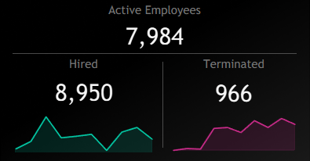
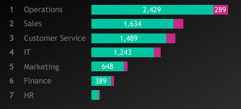
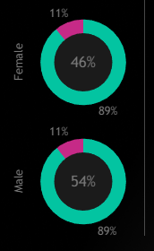
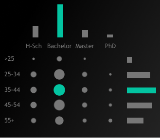
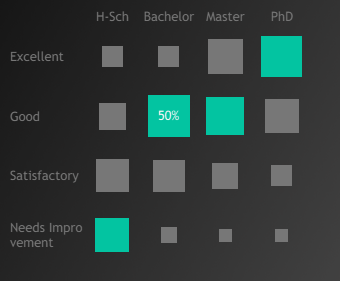
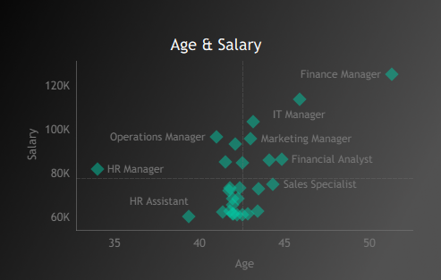
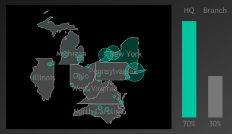

<h1 align="center">Human Resources Report</h1>
<table align="center">
  <tr>
    <td width="1440">
      <h2 align="center">Client Background</h2>
      <body>
      

        <a href="https://public.tableau.com/app/profile/subrina.eva/viz/HRAnalytics_17744196866960/HRSummary">
          <strong> See the analysis in action </strong> 
        </a>
      

        This HR Analytics project analyzes workforce data from a mid-sized organization operating across multiple departments including Operations, Sales, Customer Service, IT, Marketing, Finance, and Human Resources. Over the past several years, the company has experienced steady workforce growth while also facing challenges related to employee retention, workforce distribution, and compensation management.  
         
        The organization manages a workforce of approximately <strong>8,950 employees</strong>, with <strong>7,984 currently active employees</strong> and <strong>966 recorded terminations</strong> during the analyzed period. The available HR dataset spans multiple workforce dimensions including employee demographics, job roles, education levels, salary ranges, hiring dates, and geographic distribution across <strong>8 states and 24 cities</strong>  
         Reporting to the HR leadership team, an in-depth workforce analysis was conducted to evaluate employee trends between <strong>2015 and 2024</strong>. This analysis provides insights that help HR managers and business leaders better understand workforce composition, hiring activity, departmental distribution, compensation patterns, and employee tenure. The key insights and recommendations focus on the following areas:
      </body> 
      <h3>Northstar Metrics</h3>
      <h4>
        <ul><li>Workforce overview – tracking total employees,   hiring activity, and terminations</li>
          <li>Department distribution – understanding employee allocation across departments</li>
          <li>Demographic insights – analyzing gender, age, and education patterns</li>
          <li>Compensation analysis – exploring salary distribution across roles and education levels</li>
          <li>Geographic distribution – identifying employee presence across locations</li> 
          <li>Employee tenure – evaluating workforce retention and length of employment</li>
        </ul>
      </h4>
    </td>
  </tr>
</table>
<table align="center">
  <tr>
    

      <h1 align="center">Executive Summary</h1>
      <h3 align="center">Workforce Trends and HR Performance Analysis (2015–2024)</h3>
      

      
      

      <td width="460" valign="top">
        <ol>
          <li>
            <strong>Workforce Growth and Stability</strong>
           <ul>
             <li>The organization employs 8,950 employees, including 7,984 active employees and 966 terminated employees.</li>
             <li>The relatively low termination proportion suggests that the company maintains a stable workforce while continuing to expand its employee base.</li>
              </ul>
            </li>
          <li>
            <strong>Department Workforce Concentration</strong>
            <ul>
              <li>The workforce is heavily concentrated in Operations (27%) and Sales (18%), making them the largest contributors to the organization’s workforce structure.</li>
              <li>Because of their size, these departments also experience the highest employee movement, reflecting operational and revenue-driven roles.</li>
            </ul>
          </li>
          <li>
            <strong>Workforce Demographics and Education</strong>
            <ul>
              <li>The workforce maintains a balanced gender distribution (54% male, 46% female).</li>
              <li>Bachelor’s degree holders dominate the workforce (61%), while employees with advanced degrees demonstrate stronger performance outcomes.</li>
        </ol>
      </td>
      <td width="460" valign="top">
        <ol start="4">
          <li>
            <strong>Salary Structure and Career Progression</strong>
            <ul>
              <li>Managerial roles such as Finance Manager, IT Manager, and Sales Manager receive the highest compensation, reflecting their strategic importance.</li>
              <li>Salary levels generally increase with experience and seniority, indicating a clear career progression structure.</li>
            </ul>
          </li>
          <li>
            <strong>Key Takeaways & Recommendations</strong>
            <ul>
              <li>Focus workforce planning on Operations and Sales, as these departments represent the largest employee segments.</li>
              <li>Continue supporting balanced workforce demographics and diversity initiatives.</li>
              <li>Invest in professional development programs to strengthen employee skills and career progression.</li>
              <li>Maintain competitive compensation structures for leadership roles to retain experienced talent.</li>
              <li>Strengthen regional workforce planning to support operations across headquarters and branch locations.</li>
          </li>
        </ol>
      </td>
    

  </tr>
</table>

<h1 align="center">Insights Deep-Dive</h1>

<table align="center">
  <tr>
     <h1 align="center">Department Workforce Analysis</h1>
      

        <h3>Employees Hired and Terminated by Department</h3>
        

       
      

    <tr>
  </tr>
</table>
<table align="center">
  <tr>
      <td width="333" valign="top">
      <h3>Operations Department</h3>
      <ul>
        <li>The Operations department is the largest workforce segment, with 2,429 hires (27%) and 289 terminations (3%).</li>
        <li>As the operational backbone of the company, it supports daily activities and therefore experiences the highest employee movement.</li>
        <li>Although it has the most terminations, the rate remains proportional to department size, indicating no major retention concern.</li>
      </ul>
      </td>
     <td width="333" valign="top">
      <h3>Sales Department</h3>
      <ul>
        <li>The Sales department is the second-largest workforce group, with 1,634 hires (18%) and 201 terminations (2%).</li>
        <li>Although sales roles often have higher turnover due to performance-driven environments, the department remains a key contributor to business growth and revenue.</li>
      </ul>
      </td>
      <td width="333" valign="top">
      <h3>Human Resources Department</h3>
      <ul>
       <li>The Human Resources department is the smallest workforce group, with 152 hires (2%) and 20 terminations (less than 1%).</li>
       <li>This reflects the typically lean structure of HR teams while supporting the entire organization.</li>
      </td>
</tr>
</table>
<table align="center">
  <h1 align="center">Workforce Demographics</h1>
  <tr>
    <td width="500">
       

       <h3>Gender Composition of the Workforce</h3>
       
    

    </td>
    <td valign="Middle" width="500">
      <ul>
        <li>The workforce shows a balanced gender distribution with 4,801 male employees (54%) and 4,149 female employees (46%).</li>
        <li>Termination rates are nearly identical across genders, with 510 male terminations (11%) and 456 female terminations (11%).</li>
        <li>The nearly identical termination proportions suggest that employee exits occur relatively evenly across gender groups, indicating no significant imbalance in workforce departures based on gender.</li>
        <li>Maintaining balanced workforce demographics supports diversity and inclusion objectives while contributing to a more equitable workplace environment.</li>
      </ul>
    </td>
  </tr>
</table>
<table align="center">
  <tr>
    <h1 align="center">Education and Performance Insights</h1>
    <table align="center">
    <tr align="center">
      <td width="1000">
      <h3>Education Distribution by Age Group</h3>
      
    </td>
    <td width="1000">
      <h3>Employee Performance by Education Level</h3>
      
    </td>
  </tr>
</table>
    <table>
      <tr>
        <td>
        <body>The workforce is dominated by mid-career professionals with Bachelor’s degrees, while advanced degree holders show the strongest performance outcomes.
        </body>
          <ul>
            <li>The workforce is primarily composed of employees with Bachelor’s degrees, totaling 5,416 employees (61% of the workforce), indicating that most roles require professional-level academic qualifications.</li>
            <li>The 35–44 age group represents the largest workforce segment, with 2,625 employees (29%). Within this group, Bachelor’s degree holders dominate, accounting for 1,577 employees (60%), highlighting the organization’s strong mid-career workforce base.</li>
            <li>Employees with Bachelor’s degrees most frequently receive “Good” performance ratings, with 2,706 employees (50%), suggesting consistent performance across the largest education group.</li>
            <li>Employees holding Master’s degrees also demonstrate strong performance, with 504 employees (41%) receiving “Good” ratings, indicating strong contributions from advanced-degree professionals.</li>
            <li>The highest proportion of “Excellent” performance ratings occurs among PhD holders, where 228 employees (48%) fall into the Excellent category, showing that highly specialized employees tend to deliver the strongest performance outcomes.</li>
            <li>In contrast, employees with High School education appear more frequently in the “Needs Improvement” category, with 618 employees (34%), suggesting that roles requiring lower academic qualifications may face greater performance challenges.</li>
          </ul>
        </td>
      </tr>
    </table>
  </tr>
</table>
<table align="center">
  <tr>
    <h1 align="center">Salary and Role Insights</h1>
    <td width="1000">
      
    </td>
  </tr>
</table>
<table>
  <tr>
    <td>
      <ol>
        <li>Managerial roles receive the highest compensation.
          <ul>
            <li>Finance Manager is the highest-paid role with an average salary of <strong>$125,143</strong> and an average age of <strong>51</strong>, followed by <strong>IT Manager ($113,907, age 46)</strong> and <strong>Sales Manager ($103,796, age 43)</strong>. These roles involve strategic leadership and major business decision-making. </li>
          </ul>
        </li>
        <li>Mid-level professional roles fall in the middle salary range.
          <ul>
            <li>Positions such as <strong>Operations Manager, Marketing Manager, Software Developer, and Financial Analyst</strong> typically earn between <strong>$90K and $100K</strong>, reflecting experienced specialists and department leaders. </li>
          </ul>
        </li>
        <li>Operational and support roles occupy the lower salary range.
          <ul>
            <li>Roles such as <strong>HR Assistant, Accounts Payable Specialist, Recruiter, Content Creator, and Support Specialist</strong> generally earn between <strong>$60K and $70K</strong>, representing entry-level and support positions.</li>
          </ul>
        <li>Salary generally increases with experience and seniority.
          <ul>
            <li>The scatter plot shows that higher salaries tend to appear among employees in their <strong> mid-40s to early-50s</strong>, indicating that compensation grows with career progression and leadership responsibilities.</li>
          </ul>
        </li>
      </ol>
    </td>
  </tr>
</table>
<table align="center">
  <h1 align="center">Geographic Workforce Distribution</h1>
      

       
      

  <tr valign="top">
     <td width="900">
      <ul>
        <li>The majority of the workforce is located at the Headquarters (HQ).</li>
          <ul>
            <li>6,270 employees are based at HQ, representing 70% of the total workforce.</li>
          </ul>
        <li>In contrast, Branch locations account for 30% of employees.</li>
           <ul> 
             <li>with 2,680 employees working across multiple regional offices.</li>
            </ul> 
        <li>The largest branch workforce concentration is located in Michigan, employing 976 employees, making it the most significant regional workforce hub outside the headquarters.</li>
          <ul>
            <li>Other major workforce locations include: Pennsylvania – 435 employees, North Carolina – 430 employees, Illinois – 285 employees, Ohio – 271 employees</li>
            <li>Smaller workforce clusters exist in: Virginia – 180 employees, West Virginia – 103 employees</li>
          </ul>
        <li>The New York City headquarters represents the organization's central operational hub, with 2,959 employees hired in this location.</li>
          <ul>
            <li>This concentration suggests that major strategic, managerial, and corporate functions are based within the headquarters region.</li>
          </ul>
      </ul>
    </td>
  </tr>
</table>
<table align="center">
    <h1>Recommendations</h1>
    <h4>Based on the workforce insights identified in the analysis, the following strategic actions are recommended.</h4>
      <ul>
        <h3>Departments</h3>
        <li>Strengthen workforce planning within the Operations department.</li>
          <ul><li>The Operations department represents the largest workforce segment with 2,429 hires (27%).</li>
          <li>Workforce forecasting and staffing strategies should ensure operational continuity and prevent staffing shortages.</li></ul>
        <li>Monitor retention trends within the Sales department.</li>
          <ul><li>Sales roles often experience higher movement due to performance-driven environments.</li>
          <li>Incentive programs and career development opportunities may help maintain workforce stability.</li></ul>
        <h3>Demographics</h3>
        <li>Maintain balanced gender representation across the workforce.</li>
          <ul><li>The workforce shows a balanced distribution with 54% male and 46% female employees.</li>
          <li>Termination rates are nearly identical across genders, suggesting no major imbalance in workforce exits.</li></ul>
        <li>Continue promoting diversity and inclusion initiatives.</li>
          <ul><li>Maintaining workforce diversity supports equitable hiring and promotion practices across the organization.</li></ul>
        <h3>Education and Performance</h3>
        <li>Invest in professional development programs for Bachelor-level employees.</li>
          <ul><li> Employees with Bachelor’s degrees represent 61% of the workforce, making them the largest talent group.</li>
            <li>Leadership training and certification programs can help develop future managers and specialists.</li></ul>
        <li>Leverage highly educated employees for strategic and innovation-driven roles.</li>
          <ul><li>Employees with PhD degrees show the highest “Excellent” performance proportion (48%).</li></ul>
          <ul><li>These employees may contribute strongly to research, innovation, and high-impact projects.</li></ul>
          <li>Provide targeted training support for employees requiring improvement.</li>
          <ul><li>Employees with High School education levels appear more frequently in the “Needs Improvement” category (34%).</li></ul>
          <ul><li>Skill development programs may help improve performance outcomes within this group.</li></ul>
        <h3>Salary and Role</h3>
        <li>Maintain competitive compensation for leadership roles.</li>
          <ul><li>Positions such as Finance Manager, IT Manager, and Sales Manager command the highest salaries.</li>
          <li>Competitive compensation helps retain experienced leadership and strategic talent.</li></ul>
          <li>Create clearer career progression pathways for mid-level professionals.</li>
          <ul><li>Roles such as Software Developer, Operations Manager, and Financial Analyst fall within the mid-salary range.</li>
          <li>Structured promotion pathways may improve employee retention and career growth.</li></ul>
        <h3>Geographics</h3>
        <li>Continue leveraging headquarters as the central strategic hub.</li>
          <ul><li>70% of employees are located at headquarters, indicating centralized corporate operations.</li></ul>
        <li>Strengthen workforce development across regional offices.</li>
          <ul><li>Branch locations account for 30% of employees, with major workforce clusters in Michigan, Pennsylvania, and North Carolina.</li></ul>
          <ul><li> Supporting regional talent development can improve operational efficiency across locations.</li></ul>
      </ul>
</table>